# Arquitectura de Computadoras - 2024
## Informe Lab2:  Análisis de microarquitecturas

## Integrantes:

 - Santiago Usaj
 - Federico Di Forte
 - Ronnie Murphy

## Indice 

1. [Ejecricio 1](#1-ejercicio-1)
2. [Ejercicio 2](#2-ejercicio-2)
3. [Ejercicio 3](#3-ejercicio-3)


## 1. Ejercicio 1

En este ejercicio vamos a prueba a nuestro procesador con Daxpy, la cual es la rutina principal del LINPACK Benchmark, para ver la performance de este segun el tamaño y tipo de memoria cache.

Puntos: 

## a)  

Escribir el código del microbenchmark daxpy en assembler ARMv8 y verificar su funcionamiento con qemu.

Sea alpha una constante, X, Y y Z vectores de longitud N (todos ellos
expresados como valores en punto flotante).

Codigo en C:
```c
const int N;
double X[N], Y[N], Z[N], alpha;

for (int i = 0; i < N; ++i) {
    Z[i] = alpha * X[i] + Y[i];
}
```
Codigo en assembler ARMv8:
```
	// Inicialización		
	ldr     d10, [x10]      // Cargar Alpha en d10
	
	mov     x5, 0           // Inicializar índice i

.L2:
	cmp     x5, x0          // Comparar i con N
	b.ge    .L1             // Si i >= N, salir del bucle

	// Operación Z[i] = Alpha * X[i] + Y[i]
	ldr     d0, [x2, x5, lsl #3] // Cargar X[i] en d0
	ldr     d1, [x3, x5, lsl #3] // Cargar Y[i] en d1
	fmul    d2, d10, d0     // Multiplicar Alpha * X[i] -> d2
	fadd    d3, d2, d1      // Sumar Y[i] + (Alpha * X[i]) -> d3
	str     d3, [x4, x5, lsl #3] // Guardar Z[i] en memoria

	// Incrementar índice
	add     x5, x5, 1       // i++

	b       .L2             // Repetir el bucle

.L1:
```

## b)

  Correr la simulación para los siguientes tamaños de caché de datos: [8KB, 16KB, 32KB] de mapeo directo (1 vía) y obtener las siguientes métricas: número de ciclos (numCycles), ciclos ociosos (idleCycles), hits totales en la caché de datos (overallHits) y hits de lectura en la caché de datos (ReadReq.hits).

### [Resultados de la simulación con 8kB](./resultados/8kb-1assoc.txt)

* Numero de ciclos: 221389.0

* Ciclos ociosos: 141030.0

* Hits totales en la caché de datos: 798.0

* Hits de lectura en la caché de datos: 477.0


### [Resultados de la simulación con 16kB](./resultados/16kb-1assoc.txt)

* Numero de ciclos: 221433.0

* Ciclos ociosos: 141074.0

* Hits totales en la caché de datos: 798.0

* Hits de lectura en la caché de datos: 477.0

### [Resultados de la simulación con 32kB](./resultados/32kb-1assoc.txt)

* Numero de ciclos: 221453.0

* Ciclos ociosos: 141094.0

* Hits totales en la caché de datos: 798.0

* Hits de lectura en la caché de datos: 477.0

## c) 

Repetir el punto b) pero para cachés asociativas por conjuntos de 2, 4 y 8 vías (parámetro “asoc” en el archivo in_order.py).

### Caché asociativas por conjuntos de 2

#### [Resultados de la simulación con 8kB](./resultados/8kb-2assoc.txt)

* Numero de ciclos: 189261.0

* Ciclos ociosos: 119162.0

* Hits totales en la caché de datos: 4781.0

* Hits de lectura en la caché de datos: 4714.0


#### [Resultados de la simulación con 16kB](./resultados/16kb-2assoc.txt)

* Numero de ciclos: 188833.0

* Ciclos ociosos: 118777.0

* Hits totales en la caché de datos: 4782.0

* Hits de lectura en la caché de datos: 4706.0

#### [Resultados de la simulación con 32kB](./resultados/32kb-2assoc.txt)

* Numero de ciclos: 188756.0

* Ciclos ociosos: 118593.0

* Hits totales en la caché de datos: 4769.0

* Hits de lectura en la caché de datos: 4694.0


### Caché asociativas por conjuntos de 4

#### [Resultados de la simulación con 8kB](./resultados/8kb-4assoc.txt)

* Numero de ciclos: 243159.0

* Ciclos ociosos: 187538.0

* Hits totales en la caché de datos: 10755.0

* Hits de lectura en la caché de datos: 7685.0


#### [Resultados de la simulación con 16kB](./resultados/16kb-4assoc.txt)

* Numero de ciclos: 243071.0

* Ciclos ociosos: 187448.0

* Hits totales en la caché de datos: 10755.0

* Hits de lectura en la caché de datos: 7685.0

#### [Resultados de la simulación con 32kB](./resultados/32kb-4assoc.txt)

* Numero de ciclos: 243071.0

* Ciclos ociosos: 187448.0

* Hits totales en la caché de datos: 10755.0

* Hits de lectura en la caché de datos: 7685.0


### Caché asociativas por conjuntos de 8

#### [Resultados de la simulación con 8kB](./resultados/8kb-8assoc.txt)

* Numero de ciclos: 243023.0

* Ciclos ociosos: 187403.0

* Hits totales en la caché de datos: 10755.0

* Hits de lectura en la caché de datos: 7685.0


#### [Resultados de la simulación con 16kB](./resultados/16kb-8assoc.txt)

* Numero de ciclos: 243071.0

* Ciclos ociosos: 187448.0

* Hits totales en la caché de datos: 10755.0

* Hits de lectura en la caché de datos: 7685.0

#### [Resultados de la simulación con 32kB](./resultados/32kb-8assoc.txt)

* Numero de ciclos: 243071.0

* Ciclos ociosos: 187448.0

* Hits totales en la caché de datos: 10755.0

* Hits de lectura en la caché de datos: 7685.0

## d) 

Graficar las métricas obtenidas en los puntos b) y c), realizar un análisis y justificar estos resultados respecto al código escrito en el punto a).

En general no encontramos diferencia según el tamaño de la memoria, el procesador se comporta de manera similar para los mismos tamaños de memoria.

### Cantidad de ciclos por cantidad de vias de caché 

Los **numCycles** representan el número total de ciclos de reloj utilizados por el procesador para ejecutar un programa o conjunto de instrucciones en una simulación o en un entorno real. Cada ciclo de reloj es una unidad básica de tiempo en la cual el procesador puede realizar operaciones, como ejecutar instrucciones, mover datos entre registros, o interactuar con la memoria.

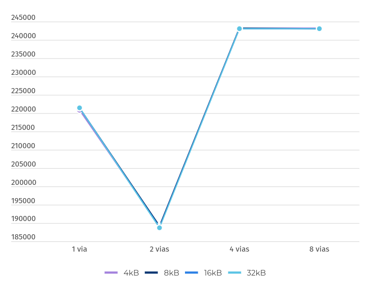

Podemos observar que al agregar vías a la caché mejora significativamente su rendimiento, en el caso de 2 vías es el que mejor rendimiento obtuvimos. Pero una vez que se complejiza y aumentamos de más la cantidad de vías, el rendimiento es aún peor que el que teníamos en un principio con una única vía.

### Cantidad de ciclos ociosos

Representa el tiempo durante el cual el procesador está inactivo porque está esperando que se completen ciertas operaciones, como el acceso a la memoria principal o la finalización de una instrucción dependiente. 


Aqui corroboramos lo dicho anteriormente, la caché de 2 vías es la de mejor rendimiento, ya que observamos en la gráfica que la misma es la que tiene menor cantidad de ciclos ociosos.

### Cantidad de hits en la caché

Son todos los accesos exitosos a la caché, tanto los accesos para escritura como lectura.

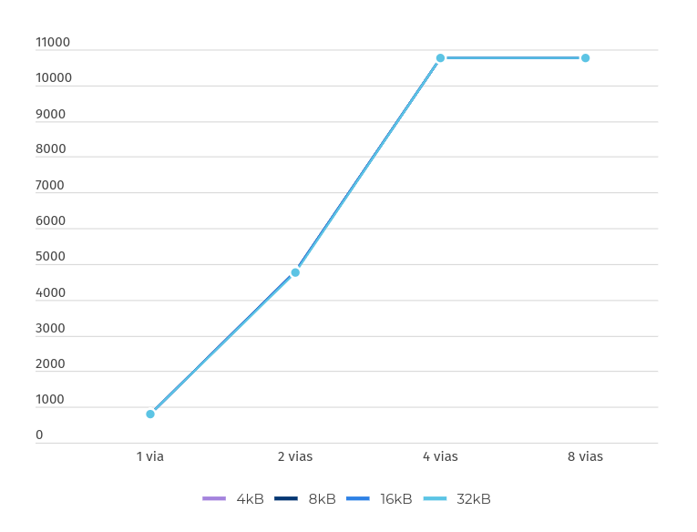

Se observa que mientras aumente la cantidad de vías, la cantidad de hits aumenta a la par hasta llegar a las 4 vías donde si se agregan más vías, estas siguen haciendo la misma cantidad de hits. Esto puede decir que la caché llegó a su límite de eficiencia.

### Cantidad de hits de lectura en la caché

Son todos los accesos exitosos a la caché, solamente para los accesos de lectura.

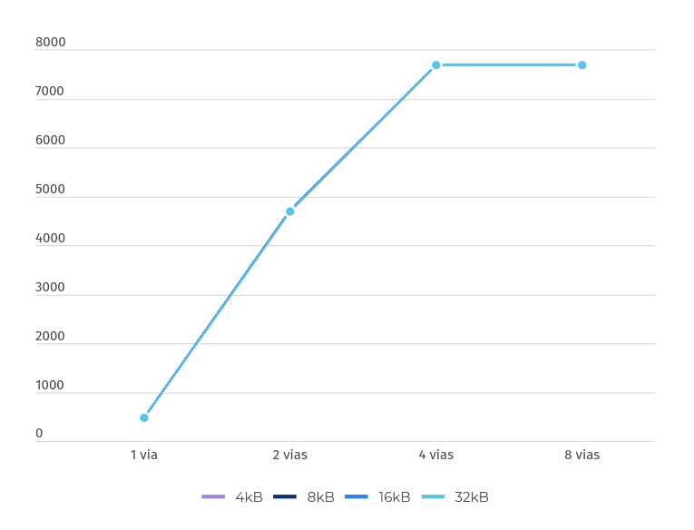

Podemos ver la misma relación que con los **overallHits**. Segun aumentamos la cantidad de vías a la caché, esta mejora su rendimiento hasta que llega a la 4 vías, donde aquí llega a su límite de eficiencia.

## e)

Reescribir el código utilizando técnicas estáticas de mejora, como loop unrolling, instrucciones condicionales, etc., para mejorar el rendimiento utilizando una caché de mapeo directo (1 vía) y el tamaño de 32KB para obtener rendimientos similares a los de 2 vías.

* Codigo optimizado: 

```
// Cargar Alpha en d10
ldr     d10, [x10]

// Inicializar índice y tamaño del desenrollado
mov     x5, 0               // Índice i
mov     x6, 8               // Desenrollar 8 iteraciones por ciclo

.L2:
    cmp     x5, x0          // Comparar i con N
    b.ge    .L1             // Si i >= N, salir del bucle

    // Prefetch para minimizar conflictos
    prfm    pldl1strm, [x2, x5, lsl #3] // Prefetch X
    prfm    pldl1strm, [x3, x5, lsl #3] // Prefetch Y
    prfm    pldl1strm, [x4, x5, lsl #3] // Prefetch Z

    // Procesar la primera iteración del bucle
    ldr     d0, [x2, x5, lsl #3]
    ldr     d1, [x3, x5, lsl #3]
    fmul    d2, d10, d0
    fadd    d3, d2, d1
    str     d3, [x4, x5, lsl #3]

    // Procesar la segunda iteración
    add     x7, x5, 1       // Calcular índice i + 1
    ldr     d4, [x2, x7, lsl #3]
    ldr     d5, [x3, x7, lsl #3]
    fmul    d6, d10, d4
    fadd    d7, d6, d5
    str     d7, [x4, x7, lsl #3]

    // Procesar la tercera iteración
    add     x8, x5, 2       // Calcular índice i + 2
    ldr     d8, [x2, x8, lsl #3]
    ldr     d9, [x3, x8, lsl #3]
    fmul    d10, d10, d8
    fadd    d11, d10, d9
    str     d11, [x4, x8, lsl #3]

    // Incrementar índice
    add     x5, x5, x6       // i += 8

    b       .L2             // Repetir el bucle

.L1:
```

### Resultados obtenidos

#### [Caché de mapeo directo y tamaño de 32kB](./resultados/32kb-1assoc-opt.txt)


#### [Caché de dos vias y tamaño de 32kB](./resultados/32kb-2assoc-opt.txt)

### Estrategias utilizadas

* **Loop unrolling**: Repetimos múltiples iteraciones del bucle dentro de un único ciclo para reducir las instrucciones de control de bucle.

	Cada iteración del bucle procesa 2 elementos en lugar de 1. Reduce las instrucciones de control del bucle `cmp` y `b`, disminuyendo la sobrecarga.

* **Pre-fetching manual**: Aseguramos que los datos futuros sean cargados en la caché antes de usarlos.

	Agregar instrucciones explícitas de prefetch `prfm` para traer datos de memoria principal a la caché antes de que se necesiten.

* **Reorganización de cálculos**: Agrupamos operaciones para explotar mejor los registros del procesador.

* **Reducción de dependencias**: Usamos múltiples registros para permitir una mayor paralelización.

* **Acceso eficiente a memoria**: El acceso a memoria para X, Y y Z utiliza desplazamientos efectivos (`lsl #` y #8 para el unrolling) para minimizar cálculos.

### Graficos

!Aclaración: La dimensión "y" de los siguientes graficos son la cantidad de ciclos.

| Cantidad de ciclos ociosos | Cantidad de ciclos por vías de caché |
|-----------------|----------------|
| 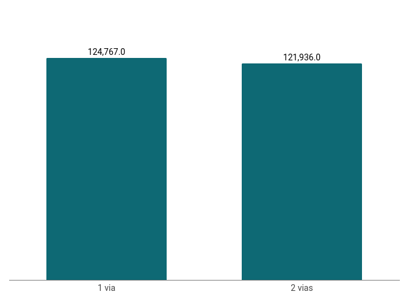 |  |


!Aclaración: La dimensión "y" de los siguientes graficos son la cantidad de accesos a caché.

| Cantidad de hits en la caché | Cantidad de hits de lectura en la caché |
|-----------------|----------------|
| 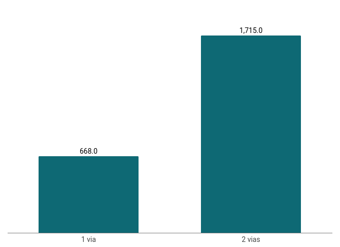 | 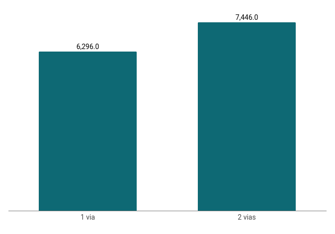 |

A la hora de ver la cantidad de ciclos ociosos o de ciclos ejecutados se obtuvo un rendimiento parecido, pero la cantidad de hits a caché no logramos obtener el mismo rendimiento.


## f)

Ejecutar la simulación utilizando el procesador out-of-order con las características de la caché utilizada en el punto e) y comparar los resultados.

#### [Procesador out-of-order](./resultados/out_of_order.txt)

### Graficos

!Aclaración: La dimensión "y" de los siguientes graficos son la cantidad de ciclos.

| Cantidad de ciclos ociosos | Cantidad de ciclos |
|-----------------|----------------|
| 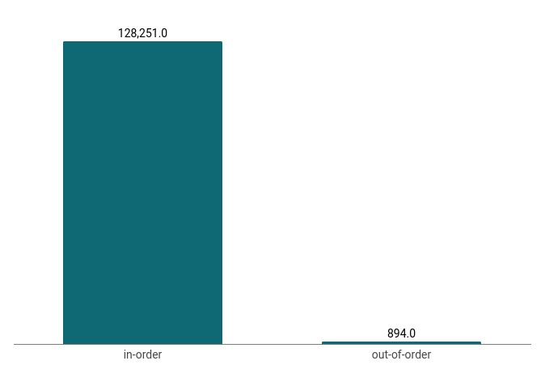 | 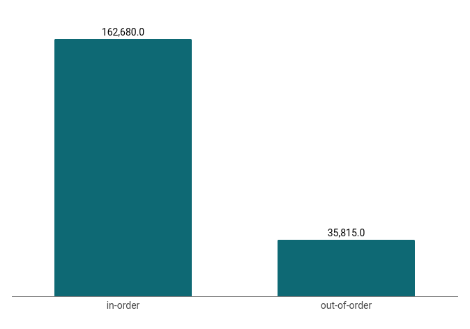 |


!Aclaración: La dimensión "y" de los siguientes graficos son la cantidad de accesos a caché.

| Cantidad de hits en la caché | Cantidad de hits de lectura en la caché |
|-----------------|----------------|
|  |  |

## 2. Ejercicio 2

En este ejercicio se nos pide simular el flujo de calor en una placa de un material uniforme.

## a) 

A partir del código dado, reescribir el algoritmo de la simulación física en assembler ARMv8 y verificar su funcionamiento en qemu.

* Codigo en C:

```c
const int n_iter, fc_x, fc_y;
float fc_temp,sum, x[N*N], x_tmp[N*N], t_amb;

// Esta parte inicializa la matriz, solo es necesaria para verificar el código
for (int i = 0; i < N*N; ++i)
	x[i] = t_amb;

x[fc_x*N+fc_y] = fc_temp;

// -------------------------------------------------------------------------------

for(int k = 0; k < n_iter; ++k) {
	for(int i = 0; i < N; ++i) {
		for(int j = 0; j < N; ++j) {
			if((i*N+j) != (fc_x*N+fc_y)){
				sum = 0;
				if(i + 1 < N)
					sum = sum + x[(i+1)*N + j];
				else
					sum = sum + t_amb;
				if(i - 1 >= 0)
					sum = sum + x[(i-1)*N + j];
				else
					sum = sum + t_amb;
				if(j + 1 < N)
					sum = sum + x[i*N + j+1];
				else
					sum = sum + t_amb;
				if(j - 1 >= 0)
					sum = sum + x[i*N + j-1];
				else
					sum = sum + t_amb;
				x_tmp[i*N + j] = sum / 4;
			}
		}
	}
	for (int i = 0; i < N*N; ++i)
		if(i != (fc_x*N+fc_y))
			x[i] = x_tmp[i];
}
```

* Codigo en assembler ARMv8:

```

    // Inicializar la matriz
    ldr     x0, =N                  // Tamaño de la matriz (64)
    ldr     x0, [x0]                // Cargar el valor de N
    ldr     x1, =x                  // Dirección de x
    ldr     x2, =x_tmp              // Dirección de x_tmp
    ldr     x3, =n_iter             // Dirección de n_iter
    ldr     x3, [x3]                // Cargar el valor de n_iter
    ldr     x4, =t_amb              // Dirección de t_amb
    ldr     d1, [x4]                // Cargar t_amb en d1
    mov     x5, #0                  // i = 0
    mul     x6, x0, x0              // N*N

initialize_loop:
    cmp     x5, x6                  // Comparar i con N*N
    bge     end_initialize          // Salir si i >= N*N
    str     d1, [x1, x5, lsl #3]    // Almacenar t_amb en x[i] (8 bytes por celda)
    add     x5, x5, #1              // Incrementar i
    b       initialize_loop         // Repetir

end_initialize:
    // Establecer x[fc_x*N + fc_y] = fc_temp
    ldr     x16, =fc_x              // Dirección de fc_x
    ldr     x16, [x16]              // Cargar fc_x en x16
    ldr     x17, =fc_y              // Dirección de fc_y
    ldr     x17, [x17]              // Cargar fc_y en x17
    ldr     x18, =N                 // Dirección de N
    ldr     x18, [x18]              // Cargar N en x18
    mul     x16, x16, x18           // fc_x * N
    add     x16, x16, x17           // fc_x * N + fc_y
    ldr     x19, =fc_temp           // Dirección de fc_temp
    ldr     d5, [x19]               // Cargar fc_temp en d5
    ldr     x20, =x                 // Dirección de x
    str     d5, [x20, x16, lsl #3]  // Almacenar fc_temp en x[fc_x * N + fc_y]

iterate_matrix:
    mov     x7, #0                  // k = 0

outer_loop:
    cmp     x7, x3                  // Comparar k con n_iter
    bge     end_iterate             // Salir si k >= n_iter
    mov     x8, #0                  // i = 0

row_loop:
    cmp     x8, x0                  // Comparar i con N
    bge     next_iteration          // Salir si i >= N
    mov     x9, #0                  // j = 0

column_loop:
    cmp     x9, x0                  // Comparar j con N
    bge     next_row                // Salir si j >= N
    mul     x10, x8, x0             // i * N
    add     x10, x10, x9            // i * N + j
    mul     x11, x16, x0            // fc_x * N
    add     x11, x11, x17           // fc_x * N + fc_y
    cmp     x10, x11                // Comparar (i*N + j) con (fc_x*N + fc_y)
    beq     skip_cell               // Saltar si son iguales

    // Calcular la suma de los vecinos
    fmov    d2, d0                  // sum = 0
    add     x12, x8, #1             // i + 1
    cmp     x12, x0                 // Comparar i + 1 con N
    bge     add_t_amb1              // Si i + 1 >= N, usar t_amb
    mul     x13, x12, x0            // (i + 1) * N
    add     x13, x13, x9            // (i + 1) * N + j
    ldr     d3, [x1, x13, lsl #3]   // Cargar x[(i + 1)*N + j]
    b       add_sum1

add_t_amb1:
    ldr     d3, [x4]                // Cargar t_amb en d3

add_sum1:
    fadd    d2, d2, d3              // sum = sum + x[(i + 1)*N + j] o t_amb

    sub     x12, x8, #1             // i - 1
    cmp     x12, #0                 // Comparar i - 1 con 0
    blt     add_t_amb2              // Si i - 1 < 0, usar t_amb
    mul     x13, x12, x0            // (i - 1) * N
    add     x13, x13, x9            // (i - 1) * N + j
    ldr     d3, [x1, x13, lsl #3]   // Cargar x[(i - 1)*N + j]
    b       add_sum2

add_t_amb2:
    ldr     d3, [x4]                // Cargar t_amb en d3

add_sum2:
    fadd    d2, d2, d3              // sum = sum + x[(i - 1)*N + j] o t_amb

    add     x12, x9, #1             // j + 1
    cmp     x12, x0                 // Comparar j + 1 con N
    bge     add_t_amb3              // Si j + 1 >= N, usar t_amb
    mul     x13, x8, x0             // i * N
    add     x13, x13, x12           // i * N + (j + 1)
    ldr     d3, [x1, x13, lsl #3]   // Cargar x[i*N + j + 1]
    b       add_sum3

add_t_amb3:
    ldr     d3, [x4]                // Cargar t_amb en d3

add_sum3:
    fadd    d2, d2, d3              // sum = sum + x[i*N + j + 1] o t_amb

    sub     x12, x9, #1             // j - 1
    cmp     x12, #0                 // Comparar j - 1 con 0
    blt     add_t_amb4              // Si j - 1 < 0, usar t_amb
    mul     x13, x8, x0             // i * N
    add     x13, x13, x12           // i * N + (j - 1)
    ldr     d3, [x1, x13, lsl #3]   // Cargar x[i*N + j - 1]
    b       add_sum4

add_t_amb4:
    ldr     d3, [x4]                // Cargar t_amb en d3

add_sum4:
    fadd    d2, d2, d3              // sum = sum + x[i*N + j - 1] o t_amb

    // Dividir la suma por 4 y almacenar en x_tmp
    ldr     x14, =x_tmp             // Dirección de x_tmp
    ldr     x15, =four              // Dirección de la constante 4.0
    ldr     d4, [x15]               // Cargar 4.0 en d4
    fdiv    d2, d2, d4              // sum / 4
    str     d2, [x14, x10, lsl #3]  // Almacenar sum / 4 en x_tmp[i*N + j]

skip_cell:
    add     x9, x9, #1              // Incrementar j
    b       column_loop             // Repetir para la siguiente columna

next_row:
    add     x8, x8, #1              // Incrementar i
    b       row_loop                // Repetir para la siguiente fila

next_iteration:
    ldr     x1, =x                  // Dirección de x
    ldr     x14, =x_tmp             // Dirección de x_tmp
    mov     x15, #0                 // i = 0

copy_loop:
    cmp     x15, x6                 // Comparar i con N*N
    bge     end_copy                // Salir si i >= N*N
    mul     x10, x8, x0             // fc_x * N
    add     x10, x10, x9            // fc_x * N + fc_y
    cmp     x15, x10                // Comparar i con fc_x*N + fc_y
    beq     skip_copy               // Saltar si son iguales
    ldr     d2, [x14, x15, lsl #3]  // Cargar x_tmp[i]
    str     d2, [x1, x15, lsl #3]   // Almacenar en x[i]

skip_copy:
    add     x15, x15, #1            // Incrementar i
    b       copy_loop               // Repetir

end_copy:
    add     x7, x7, #1              // Incrementar k
    b       outer_loop              // Repetir para la siguiente iteración

end_iterate:  
```

## b) 

Ejecutar en gem5 la simulación considerando una caché de datos de mapeo directo de 32KB y predictor de saltos local (configurado por defecto).

#### [Caché de mapeo directo y tamaño de 32kB](./resultados/ej2/32kb_1assoc.txt)

## c) 

Evaluar la cantidad de ciclos que toma su ejecución utilizando cachés asociativa por conjuntos de 2, 4 y 8 vías. Determinar en qué caso se obtiene la mejor performance y explicar por qué.

### Resultados

#### [Caché asociativa por conjunto de 2 vias y tamaño de 32kB](./resultados/ej2/32kb_2assoc.txt)

* Ciclos de ejecución: 3413403.0

* Ciclos ociosos: 170388.0

#### [Caché asociativa por conjunto de 4 vias y tamaño de 32kB](./resultados/ej2/32kb_4assoc.txt)

* Ciclos de ejecución: 3456970.0

* Ciclos ociosos: 212025.0

#### [Caché asociativa por conjunto de 8 vias y tamaño de 32kB](./resultados/ej2/32kb_8assoc.txt)

* Ciclos de ejecución: 3457622.0

* Ciclos ociosos: 212421.0

### Comparación de métricas

| Cantidad de ciclos ociosos | Cantidad de ciclos por vías de caché | Cantidad de hits en la caché | Cantidad de hits de lectura en la caché |
|-----------------|----------------|-----------------|----------------|
|  |  | 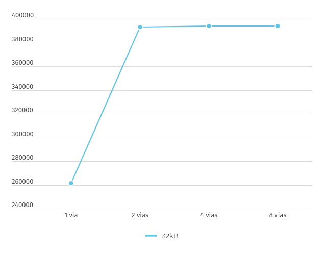 |  |


Llegamos a la conclusión que el mejor caso es donde utilizamos una caché asociativa de dos vías. Esto se debe a que con dos vías, con poca diferencia con cuatro u ocho vías, se logra un equilibrio óptimo entre la complejidad del hardware y la eficiencia en la tasa de aciertos de la caché, reduciendo significativamente los ciclos de ejecución y los ciclos ociosos en comparación con la configuración de mapeo directo.

## d) 

En este punto se pretende analizar la diferencia al usar dos predictores de saltos distintos: local y predictor por torneos (que está compuesto por un predictor local y uno global). En primer lugar se debe analizar el código e intentar deducir qué tipo de predictor (local o global) funcionará mejor en cada tipo de salto y cuánto podría mejorar usar el de torneo. Correr el código con el predator local por defecto y obtener el miss rate calculado como: 

	condIncorrect / (condPredicted + condIncorrect) 

Luego elegir el predictor por torneos (similar al utilizado en el procesador alpha 21264) y obtener nuevamente el miss rate. En ambos casos utilizar las características de la caché que obtuvo la mejor performance en el punto c). Analizar si los resultados se corresponden con lo esperado y justificar. e) Ejecutar la simulación utilizando el procesador out-of-order con l

### Resultados

#### [Predictor de salto local](./resultados/ej2/32kb-2assoc-local.txt)

* MissRate = 2031.0 / (336530.0 + 2031.0) = 0.00598

#### [Predictor de salto por torneo](./resultados/ej2/32kb-2assoc-torneo.txt)

* MissRate = 735.0 / (334559.0 + 735.0) = 0.00219

### Predictores de salto

* **Predictor Local**: Este predictor utiliza el historial de saltos de una instrucción específica para predecir el resultado de futuros saltos. Es efectivo en bucles y patrones de saltos repetitivos.

* **Predictor por Torneos**: Este predictor combina un predictor local y un predictor global. El predictor global utiliza el historial de saltos de todo el programa, mientras que el predictor local utiliza el historial de una instrucción específica. Un selector de torneos decide cuál predictor usar en función de cuál ha sido más preciso en el pasado.

### Analisis

En el código podemos observar varios bucles que son predecibles, por ejemplo:

* Bucle de Inicialización (initialize_loop): Este bucle es altamente predecible ya que itera un número fijo de veces (N*N).

* Bucle de Iteración (outer_loop, row_loop, column_loop): Estos bucles también son predecibles ya que iteran un número fijo de veces (N y n_iter).

El predictor por torneos es mejor que el local porque combina las ventajas de los predictores locales y globales, adaptándose dinámicamente a diferentes patrones de saltos. Mientras que el predictor local se basa en los últimos saltos hechos por una instrucción, en este código tenemos múltiples tipos de instrucciones de saltos generando así múltiples ramas, dificultando la precisión de la predicción. También afecta a la baja precisión de predicción tener saltos condicionales con dependencia de datos ya que se deberán calcular previamente, si estas se modifican frecuentemente, esto llevará a múltiples fallos en la predicción.

## e)

Ejecutar la simulación utilizando el procesador out-of-order con las características de la caché que obtuvo la mejor performance en el punto c) y un predictor de saltos por torneos. Comparar los resultados obtenidos con el punto d).

### Resultados

#### [Mejor optimización de procesador in-order](./resultados/ej2/32kb-2assoc-torneo.txt)

#### [Procesador out-of-order](./resultados/ej2/out-of-order.txt)

### Graficos

!Aclaración: La dimensión "y" de los siguientes graficos son la cantidad de ciclos.

| Cantidad de ciclos ociosos | Cantidad de ciclos |
|-----------------|----------------|
| 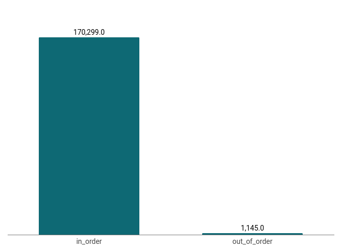 | 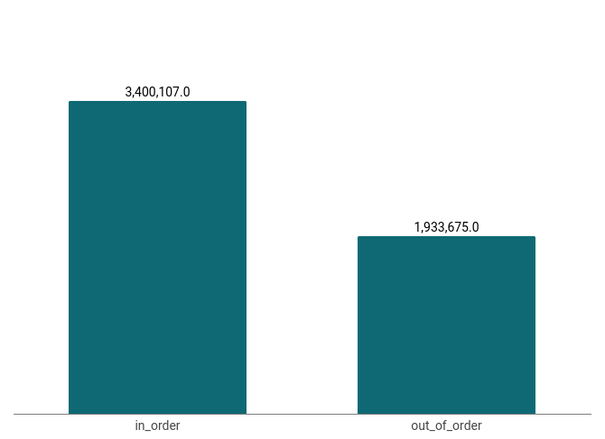 |


!Aclaración: La dimensión "y" de los siguientes graficos son la cantidad de accesos a caché.

| Cantidad de hits en la caché | Cantidad de hits de lectura en la caché |
|-----------------|----------------|
|  | 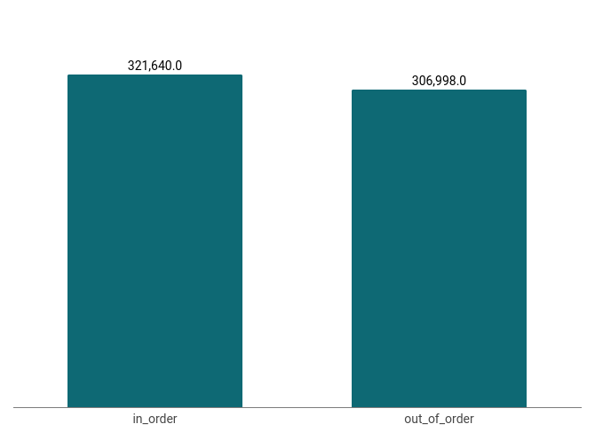 |

Se puede observar que obtenemos una cantidad similar de hits a la memoria, pero al ver los ciclos ociosos, el procesador out-of-order es ampliamente mejor que el in-order ya que apenas genera ciclos ociosos.

Esto se debe a la capacidad que tiene el procesador out-of-order de ejecutar las instrucciones en un orden diferente al que fue escrito, evitando así secuencias de instrucciones con dependencias de valores (hazards) dejando la menor cantidad de de ciclos de espera.

## 3. Ejercicio 3